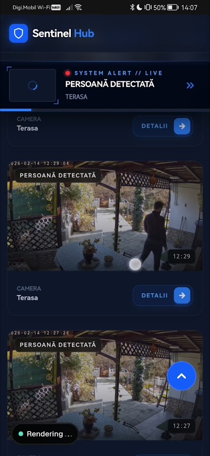

# Sentinel Security Event Hub 🛡️🛰️

Sentinel is a high-performance security monitoring dashboard designed to aggregate events from ONVIF-compatible IP cameras. It provides real-time alerts, automated video recordings, and a searchable history within a premium dark-themed interface.

Built for independent security research and personal surveillance optimization.



## 🚀 Key Features

### 🛡️ Core Security
- **Real-time Monitoring**: Instant visual alerts via SSE (Server-Sent Events) with zero-poll architecture.
- **Smart Recording**: Automated 15-second high-quality MP4 recordings triggered specifically by person detection alerts.
- **Auto-Sync (Reconciliation)**: Automatically scans storage for existing recordings on startup to ensure no event is missed.
- **Data Retention**: Intelligent cleanup policy that manages disk space while preserving important events.

### 💻 Advanced Engineering
- **ONVIF Integration**: Native communication with IP cameras using the ONVIF protocol for alarm subscriptions.
- **FFmpeg Pipeline**: Optimized video processing for low-CPU thumbnail generation and stream capturing.
- **Secure Architecture**: NextAuth.js (v5) integration for robust session management and protected API routes.
- **Modern Stack**: Next.js 16 (App Router), TypeScript, Prisma ORM, and SQLite.

## 🛠️ Tech Stack

- **Frontend**: Next.js 16, Tailwind CSS, Lucide React
- **Backend**: Node.js, Next.js Server Actions & API Routes
- **Database**: SQLite with Prisma ORM
- **Protocols**: ONVIF, RTSP, SSE
- **Processing**: FFmpeg

## ⚙️ Quick Start

1. **Clone & Install**:
   ```bash
   git clone https://github.com/epictetus-from-hierapolis/sentinel-v2.git
   npm install
   ```

2. **Configure**:
   Copy `.env.example` to `.env` and configure your camera credentials and admin account.
   ```bash
   cp .env.example .env
   ```

3. **Database Setup**:
   ```bash
   npx prisma migrate dev
   ```

4. **Create Admin User**:
   Bootstrap your system with the initial account defined in your `.env`:
   ```bash
   node scripts/create-user.mjs
   ```

5. **Run**:
   ```bash
   npm run dev
   ```

## 🐳 Docker Deployment

Sentinel is container-ready. Use the provided `docker-compose.yml` for quick deployment:
```bash
docker compose up -d --build
```

---

## ⚖️ Legal Disclaimer

**IMPORTANT**: This project is independent open-source software and is **not** affiliated with, endorsed by, or associated with **TP-Link** or the **Tapo** brand. 

- This software interacts with cameras using standard, open protocols (ONVIF and RTSP) officially supported by manufacturers.
- It does not bypass security features, exploit vulnerabilities, or use undocumented APIs.
- Users are responsible for complying with local surveillance laws and respecting privacy.

## 📜 License

Distributed under the MIT License. See `LICENSE` for more information.

---
*Built with ❤️ for secure homes.*
